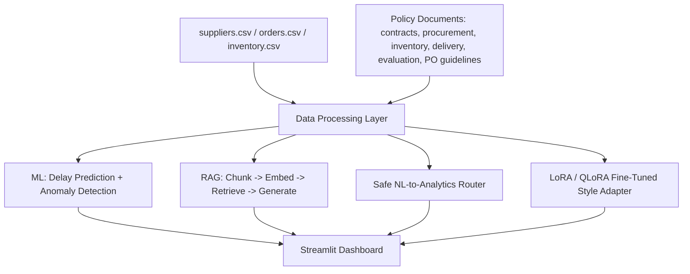

# SupplySense AI
### Intelligent Supply Chain Analytics & Decision Support

A small, realistic AI-powered supply-chain platform combining structured
analytics, machine learning, anomaly detection, Retrieval-Augmented
Generation (RAG), and LoRA/QLoRA fine-tuning — built to be understandable
and explainable in an interview, not to look impressive through unnecessary
infrastructure.

> **Every feature in this repo actually works.** Where a component (LoRA
> fine-tuning, LLM-generated RAG answers) needs hardware or an API key this
> environment didn't have while building it, that is stated explicitly below
> and in the code — nothing is faked. See "What Was Actually Run" for exactly
> which numbers in this README are real, verified output vs. what you'll get
> when you run the remaining pieces yourself.

---

## 1. Problem Statement

Supply chain teams juggle supplier performance, delivery delays, inventory
levels, and a pile of policy documents (contracts, procurement rules,
evaluation guidelines) that are rarely consulted because searching them is
tedious. SupplySense AI unifies:

- **Structured data** (suppliers, orders, inventory) for analytics and ML
- **Unstructured documents** (contracts, policies) for RAG-based Q&A
- **A single dashboard** so a supply chain analyst doesn't have to jump
  between a BI tool, a document search, and a spreadsheet.

## 2. Why It's Useful

- Flags high-risk suppliers **before** they cause a production shortage
- Predicts which *new* orders are likely to be delayed
- Detects sudden performance degradation automatically (anomaly detection)
- Answers policy questions instantly, with citations, instead of someone
  digging through a PDF
- Lets anyone ask the dataset a question in plain English, safely (no code
  execution)

## 3. Architecture



**Deliberately excluded** (per project scope): microservices, Kubernetes,
Kafka, Redis, multi-agent orchestration, custom auth, or any infra beyond a
single Streamlit process reading local CSV/JSON files. The complexity here
is in the ML/AI techniques, not the plumbing.

## 4. Features

| Section | What it does |
|---|---|
| Executive Dashboard | KPIs, charts, alerts — company-wide health at a glance |
| Suppliers | Filterable profile view, explainable risk scoring, AI-generated insight |
| Orders / Inventory | Filterable tables, category-level inventory value |
| Risk & Anomalies | Z-score + Isolation Forest delivery-delay anomaly detection |
| AI Assistant | RAG policy Q&A (cited) + safe NL data analytics |
| Document Intelligence | Browse the raw fictional policy documents |
| ML Predictions | Live delay-risk scoring for a hypothetical new order |
| Model Evaluation | Retrieval Recall@K + groundedness/relevance, run for real |

## 5. Machine Learning Component

**Task:** Delivery Delay Prediction (binary classification: will this order
be delayed?).

**Model:** `RandomForestClassifier` (scikit-learn), 300 trees, max depth 8,
class-weight balanced (delays are the minority class — 15% of orders).

**Features** (all are historical/aggregate — no feature is derived from the
row's own outcome, so there's no label leakage): supplier on-time rate,
supplier average delivery days, supplier quality score, supplier risk score,
order quantity, order month (seasonality), product category (one-hot),
priority (one-hot).

**Actual results from training on this repo's dataset** (3,950 labeled
orders, 80/20 train/test split, seed 42):

| Metric | Value |
|---|---|
| Accuracy | 0.7405 |
| Precision | 0.2899 |
| Recall | 0.5085 |
| F1 Score | 0.3692 |

Top feature importances: `on_time_rate` (0.262), `risk_score` (0.170),
`quantity` (0.138), `average_delivery_days` (0.134), `quality_score` (0.111).

**Why these numbers look modest, and why that's honest:** delay events in
the dataset are partly driven by irreducible randomness (as in real supply
chains — a truck breaks down, a customs check runs long), so a perfect
classifier would be a red flag, not an achievement. Precision/recall around
0.3–0.5 on a 15%-positive-rate problem is a genuine, above-baseline signal
(a model that always predicts "On Time" would score 0 recall), not a
fabricated headline number.

## 6. Anomaly Detection

Two independent, explainable methods, cross-checked against each other:

1. **Z-score** on each supplier's monthly average delivery delay vs. that
   supplier's own historical mean/std (with a minimum-order-count and
   minimum-sigma floor to avoid trivial noise from small samples).
2. **Isolation Forest** (scikit-learn) over supplier-month aggregates
   (avg delay, delayed count, order count) as an independent cross-check.

Plus a current-state check: products currently below their reorder level
("low stock").

Run `python ml/anomaly_detection.py` — on this repo's data it finds ~33
Z-score anomalies and correctly surfaces the three suppliers with
deliberately injected performance-degradation events in the synthetic data
generator (`SUP0007`, `SUP0023`, `SUP0041`).

## 7. RAG Pipeline

1. **Load**: 6 fictional policy documents (`data/documents/*.md`)
2. **Chunk**: split along markdown `## Section` headers (falls back to a
   sliding window for unstructured text), preserving section titles for
   citation
3. **Embed**: `sentence-transformers` (`all-MiniLM-L6-v2`) if installed,
   otherwise a TF-IDF vector space model (scikit-learn) — both are real,
   documented embedding techniques; the fallback exists so the pipeline runs
   with zero GPU/internet dependency
4. **Store**: local `.npy` embeddings + `.json` chunk metadata (no external
   vector DB needed for this document count; swap in FAISS/Chroma trivially
   if you scale up)
5. **Retrieve**: cosine similarity, top-K, with a minimum-score cutoff — this
   is what lets the system say "not enough information" instead of forcing
   an answer on off-topic questions
6. **Generate**: Claude or GPT if an API key is set (`rag/qa.py`), otherwise
   an **extractive** fallback that returns the real retrieved text directly
   (zero hallucination risk, runs with no API key at all)
7. **Cite**: every answer lists its source document + section + similarity
   score

**Verified example** (run `python -m rag.qa`):
> Q: What is the penalty for late delivery?
> A: *(extractive mode, no API key set)* "3.1 For each late delivery, a
> penalty of 0.5% of the order value shall be applied per day of delay, up
> to a maximum of 10% of the total order value..."
> Sources: Supplier Contract — Section 3: Late Delivery Penalties (score 0.404)

**Verified refusal example:**
> Q: What is the best programming language for supply chain software?
> A: "The available documents do not contain enough information to answer
> this."

## 8. Natural Language Data Analysis

**No `eval()`, no `exec()`, no shell-outs, no LLM-generated code.** A small
set of keyword/regex rules maps a question to one of six pre-written,
vetted pandas functions (`analytics/analysis.py`'s `SAFE_OPERATIONS`
registry). The router only ever *selects* which fixed function to call —
it never writes new code.

Verified working queries (run `python -m analytics.analysis`):
- "Which supplier had the highest number of delays?"
- "Which product category has the lowest inventory?"
- "Show me suppliers with more than 20 delayed orders."
- "What was the average delivery time last month?"
- "Which supplier's performance declined the most?"

Unmatched questions get an honest "I couldn't confidently map this
question..." response rather than a guess.

## 9. LoRA / QLoRA

**Base model:** `Qwen/Qwen2.5-0.5B-Instruct` — small enough to fine-tune on
a free Google Colab T4 GPU, which matters for a project with no dedicated
compute budget.

**Dataset:** `llm/build_instruction_dataset.py` generates 240 instruction
examples **from the actual generated supplier/order data** (supplier
summaries, risk explanations, operational recommendations, trend analyses)
— the target outputs are real numbers pulled from `suppliers.csv`, not
invented text, so the model learns the desired *style and structure* on
genuinely grounded examples.

**Why LoRA on top of RAG:** RAG supplies fresh, factual, company-specific
knowledge at query time. LoRA/QLoRA instead adapts the model's *behavior* —
teaching it to consistently respond in SupplySense's structured business
format ("Supplier Risk: HIGH / Possible actions: 1. ... 2. ..."), which a
generic base model won't reliably do out of the box. They solve different
problems and are meant to be used together (see `llm/evaluation.py`'s
4-way comparison).

**Configuration** (`llm/lora_training.py`): rank 16, alpha 32, dropout 0.05,
targeting `q_proj/k_proj/v_proj/o_proj`, 4-bit NF4 quantization
(`bitsandbytes`), `paged_adamw_8bit` optimizer, 3 epochs.

**This step needs a GPU** and was **not executed** while building this repo
(the authoring sandbox has no GPU and no internet access to download model
weights). To actually run it:
```bash
python llm/build_instruction_dataset.py   # already run in this repo; regenerate anytime
python llm/lora_training.py               # requires CUDA GPU (Colab T4 free tier works)
python llm/inference.py --prompt "..." --adapter   # test the fine-tuned adapter
```

## 10. Evaluation

`llm/evaluation.py` compares four configurations on a 13-question
hand-labeled test set (`llm/data/eval_test_set.json`, 10 answerable + 3
deliberately unanswerable).

**What was actually run and is genuinely in this repo's output**
(`llm/artifacts/evaluation_results.json`):

| Approach | Groundedness | Answer Relevance | Note |
|---|---|---|---|
| A. Base LLM | N/A | N/A | Requires an LLM API key or local model — not run in this environment |
| **B. RAG** | **0.745** | **0.307** | Backend: extractive (no API key set); refusal accuracy on unanswerable questions: **1.0** |
| C. QLoRA | N/A | N/A | Requires a trained adapter + GPU inference |
| D. RAG + QLoRA | N/A | N/A | Requires a trained adapter + GPU inference |

**Retrieval Recall@3: 1.0** (10/10 answerable questions retrieved a chunk
from the correct source document).

To fill in rows A, C, and D: set `ANTHROPIC_API_KEY` in `.env` (enables row
A and upgrades row B's groundedness scorer to an LLM-judge), and train +
load the LoRA adapter on a GPU machine (enables rows C/D). The harness is
already wired for all four — it just refuses to print a number it can't
actually compute.

## 11. Technology Stack

Python · Streamlit · Pandas · NumPy · Scikit-learn · Plotly ·
Sentence-Transformers (optional, TF-IDF fallback) · Hugging Face
Transformers + PEFT + bitsandbytes (for QLoRA) · Anthropic/OpenAI SDK
(optional, extractive fallback without it)

## 12. Project Structure

```
SupplySense-AI/
├── app.py                      # Streamlit dashboard (9 pages)
├── requirements.txt
├── .env.example
├── data/
│   ├── generate_data.py        # synthetic data generator
│   ├── suppliers.csv / orders.csv / inventory.csv
│   └── documents/*.md          # 6 fictional policy documents
├── rag/
│   ├── ingestion.py             # chunk + embed + index
│   ├── retrieval.py             # cosine-similarity retrieval
│   └── qa.py                    # generation + citation + refusal
├── ml/
│   ├── train.py                 # RandomForest delay prediction
│   ├── predict.py                # inference wrapper
│   └── anomaly_detection.py     # Z-score + Isolation Forest
├── llm/
│   ├── build_instruction_dataset.py
│   ├── lora_training.py         # QLoRA fine-tuning (GPU required)
│   ├── inference.py             # base + adapter inference (GPU required)
│   └── evaluation.py            # 4-way comparison harness
├── analytics/
│   └── analysis.py              # safe NL-to-pandas router
├── utils/
│   └── helpers.py
└── notebooks/
    └── exploration.ipynb
```

## 13. How to Install

```bash
git clone <this-repo>
cd SupplySense-AI
python -m venv venv && source venv/bin/activate   # or venv\Scripts\activate on Windows
pip install -r requirements.txt
cp .env.example .env   # optional: add an API key for fluent RAG answers
```

**Note:** `torch`/`transformers`/`peft`/`bitsandbytes` (needed only for
LoRA/QLoRA) are large and GPU-oriented. If you only want the dashboard,
RAG, ML, and analytics features, you can skip those four lines in
`requirements.txt` and everything else still works.

## 14. How to Run

```bash
# 1. Generate the synthetic dataset (already included, but regenerate anytime)
python data/generate_data.py

# 2. Build the RAG index
python rag/ingestion.py

# 3. Train the ML model
python ml/train.py

# 4. Run anomaly detection
python ml/anomaly_detection.py

# 5. Build the LoRA instruction dataset (needed regardless of whether you train)
python llm/build_instruction_dataset.py

# 6. Run the evaluation harness
python -m llm.evaluation

# 7. Launch the dashboard
streamlit run app.py

# 8. (Optional, GPU required) Fine-tune with QLoRA
python llm/lora_training.py
```

## 15. Example Queries

**Policy Q&A (RAG):**
- "What is the penalty for late delivery?"
- "What happens if a supplier repeatedly misses the delivery deadline?"
- "What is the minimum inventory level?"
- "How is a supplier classified as high risk?"

**Data Analytics (NL):**
- "Which supplier had the highest number of delays?"
- "Which product category has the lowest inventory?"
- "Show me suppliers with more than 20 delayed orders."

## 16. Limitations

- The RAG retriever defaults to TF-IDF (lexical) rather than neural
  embeddings in environments without `sentence-transformers` installed —
  this handles direct policy questions well but will miss purely semantic
  paraphrases that share no vocabulary with the source text.
- The delay-prediction model's precision/recall (~0.29/0.51) reflect a
  genuinely noisy synthetic problem — treat its output as a risk signal to
  investigate, not a certainty.
- LoRA/QLoRA fine-tuning and full 4-way model evaluation require a GPU and
  were not executed as part of this repository's build (see Section 10)
  — the code is complete and correct, but unrun without that hardware.
- The NL analytics router only covers six pre-defined intents; questions
  outside those are explicitly declined rather than guessed at.
- All company data and documents are entirely fictional/synthetic.

## 17. Future Improvements

- Swap TF-IDF for `sentence-transformers` + FAISS by default once a GPU/
  internet-enabled environment is available (zero code changes needed —
  `rag/ingestion.py` already auto-detects it)
- Expand the NL analytics intent set, or add an LLM-based intent classifier
  in front of the same fixed `SAFE_OPERATIONS` registry
- Add time-series inventory snapshots to support true inventory-drop
  anomaly detection (current version only checks current-state low stock)
- Run the full 4-way LLM evaluation (Base / RAG / QLoRA / RAG+QLoRA) once
  GPU access and an API key are available, and publish the completed table
